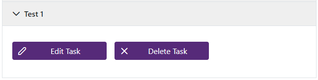
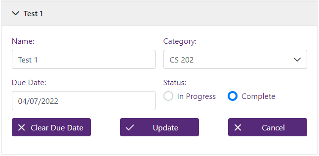
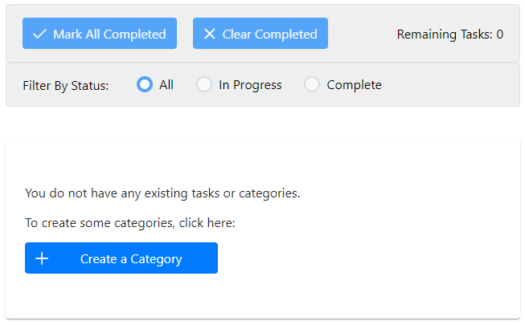
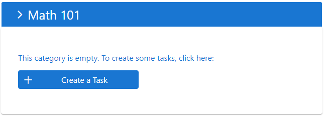

  

# Box It

[Box It](https://box-it-b5c6c.web.app/) is a task list manager web application that gives users a large amount of customization and control over how their task list is displayed and organized. Users can create color-coordinated categories to group their tasks. Users can also make unlimited changes to the names, colors, due dates, and completion status of tasks and categories.

- Website: [Box It](https://box-it-b5c6c.web.app/)

## Technologies Used

- [React](https://reactjs.org/)
- [JavaScript](https://developer.mozilla.org/en-US/docs/Web/JavaScript)
- [Redux-Toolkit](https://redux-toolkit.js.org/)
- [Firebase](https://firebase.google.com/)
- [PrimeReact](https://www.primefaces.org/primereact/)
- [CSS](https://developer.mozilla.org/en-US/docs/Web/CSS)

## Features

### Login and Signup

A user can create an account, or log in using an existing account. For users who want to try out the website first, there is an option to try a demo of the website without creating an account.

|                 Login                 |                 Sign Up                  |
| :-----------------------------------: | :--------------------------------------: |
|  |  |

### Create a Category

Users can create a category that will be used to color-coordinate and organize tasks.

  

### Create a Task

Users can create unlimited tasks, sort them into categories, and optionally assign a due date to the task.

  

### Delete All Saved Tasks and Categories

Users have the option to delete all of their saved tasks and categories with the click of a single button.

  

### Viewing All Tasks

Users can see all of their tasks and categories displayed at once on the Tasklist page. Here, they are able to filter tasks by completion status, change the completion status of all tasks at once, make edits to tasks and categories, and delete tasks and categories.

  

#### Editing Categories

Users can edit and delete categories from the Tasklist page.

|               Viewing a Cateogry               |
| :--------------------------------------------: |
|  |

|                   Editing a Category                   |
| :----------------------------------------------------: |
|  |

#### Editing Tasks

Users can edit and delete tasks from the Tasklist page.

|                   Viewing a Task (Due Date)                   |
| :-----------------------------------------------------------: |
|  |

|                        Viewing a Task (No Due Date)                         |
| :-------------------------------------------------------------------------: |
|  |

|                 Editing a Task                 |
| :--------------------------------------------: |
|  |

#### Filtering

Users can use the filters to change which tasks are displayed, and also make changes to the completion status of all tasks at once.

|                  Filtering (No Active Tasks)                   |
| :------------------------------------------------------------: |
|  |

|                    Filtering (No Completed Tasks)                    |
| :------------------------------------------------------------------: |
|  |

|                    Filtering (No Tasks or Categories)                     |
| :-----------------------------------------------------------------------: |
|  |

|             Viewing a Category with No Tasks             |
| :------------------------------------------------------: |
|  |

## Future Features

- Create the "User Settings" page, giving users the ability to make changes to their accounts. This would also allow demo users to create a permanent account while saving the information entered during their session.

- Create a calendar page, so that users can track their due dates visually.

- Allow users to track "on-going" tasks - these would be tasks which do not have a set due date, but are re-occurring.
