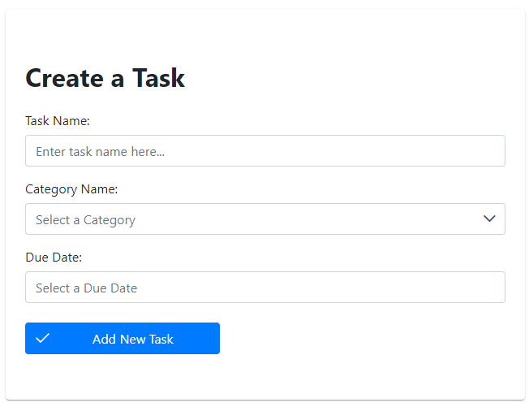

  

# Box It

Box It is a task list manager web application that gives users a large amount of customization and control over how their task list is displayed and organized. Users can create color-coordinated categories in order to group their tasks, and make unlimited changes to the names, colors, due dates, and completion status of tasks and categories.

- Website: [Box It](https://box-it-b5c6c.web.app/)

## Technologies Used

- [React](https://reactjs.org/)
- [JavaScript](https://developer.mozilla.org/en-US/docs/Web/JavaScript)
- [CSS](https://developer.mozilla.org/en-US/docs/Web/CSS)
- [React Redux](https://react-redux.js.org/)
- [Redux-Toolkit](https://redux-toolkit.js.org/)
- [Firebase](https://firebase.google.com/)
- [PrimeReact](https://www.primefaces.org/primereact/)

## Features

 

### Login and Signup

  

  

  

### Create a Category

  

### Create a Task

  

### Delete All Saved Tasks and Categories

  

### Viewing All Tasks

  

#### Editing Categories

  

  

#### Editing Tasks

  

  

  

#### Filtering

  

  

  

  

## Future Features

- Create the "User Settings" page, allowing users to make changes to their accounts, and allowing demo users to connect their instance to a permanent account.

- Implement a calendar page, so that users can track their due dates visually.

- Allow users to track "on-going" tasks - tasks which do not have a set due date, but are re-occurring.
